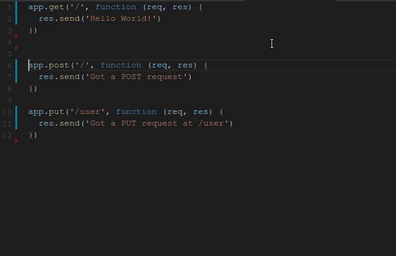

# Typewriter for VS Code - Human like typing for GIFs and live demos

## Extension Settings

* `typewriter.TypingMinSpeed`: Lower limit on how fast to type in ms - randomized between this and max
* `typewriter.TypingMaxSpeed`: Upper limit on how fast to type in ms - randomized between min and this

## Release Notes

### 1.0.0

Initial release of Typewriter!
* Set and playback text
* Control the typeing rate

## Future ideas!
* Language awareness when typing - brackets and braces first, then fill in contents
* Set the text from other sources besides a selection including files and the clipboard